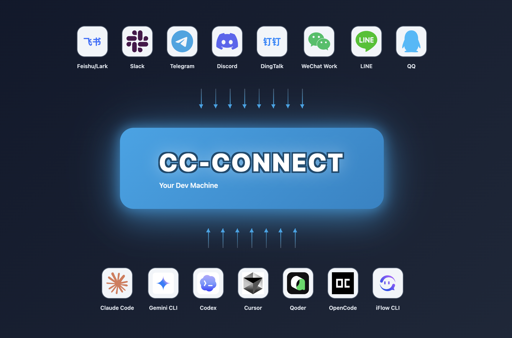
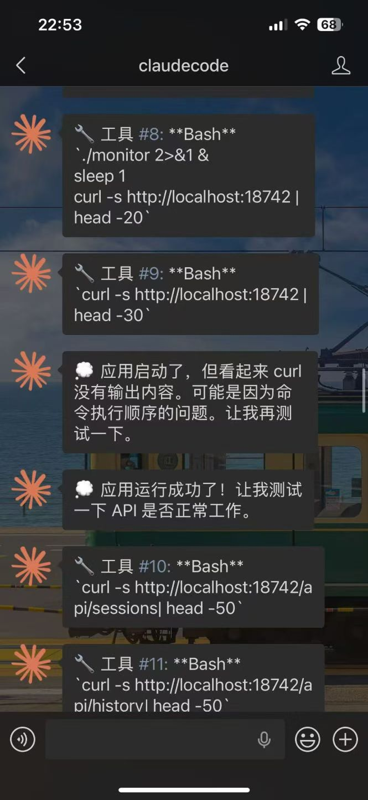

不是<p align="center">
  
</p>

<div>
打包
go build -o /tmp/cc-connect-test ./cmd/cc-connect
(base) ➜  cc-connect git:(main) ✗ /tmp/cc-connect-test

q前端启动: cd web 
npm run dev

</div>

<p align="center">
  <a href="https://github.com/chenhg5/cc-connect/actions/workflows/ci.yml">
    
  </a>
  <a href="https://github.com/chenhg5/cc-connect/releases">
    
  </a>
  <a href="https://www.npmjs.com/package/cc-connect">
    
  </a>
  <a href="https://github.com/chenhg5/cc-connect/blob/main/LICENSE">
    
  </a>
  <a href="https://goreportcard.com/report/github.com/chenhg5/cc-connect">
    
  </a>
</p>

<p align="center">
  <a href="https://discord.gg/kHpwgaM4kq">
    
  </a>
  <a href="https://t.me/+odGNDhCjbjdmMmZl">
    
  </a>
</p>

<p align="center">
  <a href="./README.md">English</a> | <a href="./README.zh-CN.md">中文</a>
</p>

---

<p align="center">
  <b>Control your local AI agents from any chat app. Anywhere, anytime.</b>
</p>

<p align="center">
  cc-connect bridges AI agents running on your machine to the messaging platforms you already use.<br/>
  Code review, research, automation, data analysis — anything an AI agent can do,<br/>
  now accessible from your phone, tablet, or any device with a chat app.
</p>

<p align="center">
  
</p>

---

## 🆕 What's New (beta)

> These highlights are in **beta / pre-release** builds — install [`cc-connect@beta`](https://www.npmjs.com/package/cc-connect?activeTab=versions) or grab a [pre-release](https://github.com/chenhg5/cc-connect/releases) binary. They are **not** in the default **stable** release yet; details may change before promotion to stable.

- **Personal WeChat** — Chat with your local agent from **Weixin (personal)** via ilink long-polling; QR `weixin setup`, CDN media, no public IP. *[Setup → `docs/weixin.md`](docs/weixin.md)*
- **Auto-compress** — When the session estimate blows past your threshold, cc-connect can trim context so long threads keep working instead of silently falling over.
- **Friendlier `--continue`** — Fork-on-continue so your bridge session doesn’t inherit a half-finished CLI terminal session by accident.
- **Cron with boundaries** — Run jobs in a **fresh session** each time and cap **per-job timeouts** so runaway tasks don’t wedge the bot.
- **Richer platforms** — e.g. **Discord** `@everyone` / `@here`, **Telegram** voice-style replies, **Feishu** fixes for reply threading and async dispatch.

---
## 本地启动
```
go build -o /tmp/cc-connect-test ./cmd/cc-connect && /tmp/cc-connect-test
```
配置文件:      
~/.cc-connect/config.toml


## 打包
`go build -o /tmp/cc-connect-test ./cmd/cc-connect`
`/tmp/cc-connect-test`


## 🧩 Platform feature snapshot

High-level view of what each **built-in platform** can do in cc-connect. Inspired by [OpenClaw China’s feature matrix](https://github.com/BytePioneer-AI/openclaw-china#功能支持) — handy for comparing channels at a glance.

**Legend**

| Symbol | Meaning |
|--------|---------|
| ✅ | Works in **stable** cc-connect with typical configuration |
| ✅（beta） | **Beta / pre-release only** — the **Weixin (personal)** column: install [`cc-connect@beta`](https://www.npmjs.com/package/cc-connect?activeTab=versions) or a [pre-release binary](https://github.com/chenhg5/cc-connect/releases); **not** in the default stable npm build yet |
| ⚠️ | Partial, needs extra config (e.g. speech / ASR), or limited by the vendor app or API |
| ❌ | Not supported or not applicable in practice |

† **QQ (NapCat / OneBot)** — unofficial self-hosted bridge; behaviour depends on your NapCat / network setup.

| Capability | Feishu | DingTalk | Telegram | Slack | Discord | LINE | WeCom | **Weixin**<br>*(personal)* | QQ† | QQ Bot |
|------------|:------:|:--------:|:--------:|:-----:|:-------:|:----:|:-----:|:-------------------------:|:---:|:------:|
| Text & slash commands | ✅ | ✅ | ✅ | ✅ | ✅ | ✅ | ✅ | ✅（beta） | ✅ | ✅ |
| Markdown / cards | ✅ | ✅ | ✅ | ✅ | ✅ | ⚠️ | ⚠️ | ✅（beta） | ✅ | ✅ |
| Streaming / chunked replies | ✅ | ✅ | ✅ | ✅ | ✅ | ✅ | ✅ | ✅（beta） | ✅ | ✅ |
| Images & files | ✅ | ✅ | ✅ | ✅ | ✅ | ⚠️ | ✅ | ✅（beta） | ✅ | ✅ |
| Voice / STT / TTS | ⚠️ | ⚠️ | ✅ | ⚠️ | ⚠️ | ❌ | ⚠️ | ✅（beta） | ⚠️ | ⚠️ |
| Private (DM) | ✅ | ✅ | ✅ | ✅ | ✅ | ✅ | ✅ | ✅（beta） | ✅ | ✅ |
| Group / channel | ✅ | ✅ | ✅ | ✅ | ✅ | ⚠️ | ✅ | ✅（beta） | ✅ | ✅ |

> **Weixin column:** every **✅（beta）** means “available only when you run a **beta / pre-release** build,” not a statement that the feature is incomplete — the whole **personal WeChat (ilink)** channel is still **pre-stable**.  
> **WeCom:** Webhook mode needs a **public URL**; long-connection / WS style setups often do not.  
> **Voice row:** many platforms need `[speech]` / TTS providers enabled in `config.toml`; values are a best-effort summary.  
> Per-platform setup: [Platform setup guides](#-platform-setup-guides) below.

---

## ✨ Why cc-connect?

### 🤖 Universal Agent Support
**7 AI Agents** — Claude Code, Codex, Cursor Agent, Qoder CLI, Gemini CLI, OpenCode, iFlow CLI. Use whichever fits your workflow, or all of them at once.

### 📱 Platform Flexibility
**10 Chat Platforms** — Feishu, DingTalk, Slack, Telegram, Discord, WeChat Work, LINE, QQ, QQ Bot (Official), plus **Weixin (personal ilink)** for **personal WeChat**. *Personal WeChat is **beta / pre-release only*** — install [`cc-connect@beta`](https://www.npmjs.com/package/cc-connect?activeTab=versions) or a [GitHub pre-release](https://github.com/chenhg5/cc-connect/releases) binary; the default **stable** npm package does **not** ship the `weixin` platform yet. Most platforms need **zero public IP**.

### 🔄 Multi-Agent Orchestration
**Multi-Bot Relay** — Bind multiple bots in a group chat and let them communicate with each other. Ask Claude, get insights from Gemini — all in one conversation.

### 🎮 Complete Chat Control
**Full Control from Chat** — Switch models (`/model`), tune reasoning (`/reasoning`), change permission modes (`/mode`), manage sessions, all via slash commands.

**Directory Switching in Chat** — Change where the next session starts with `/dir <path>` (and `/cd <path>` as a compatibility alias), plus quick history jump via `/dir <number>` / `/dir -`.

### 🧠 Persistent Memory
**Agent Memory** — Read and write agent instruction files (`/memory`) without touching the terminal.

### ⏰ Intelligent Scheduling
**Scheduled Tasks** — Set up cron jobs in natural language. *"Every day at 6am, summarize GitHub trending"* just works.

### 🎤 Multimodal Support
**Voice & Images** — Send voice messages or screenshots; cc-connect handles STT/TTS and multimodal forwarding.

### 📦 Multi-Project Architecture
**Multi-Project** — One process, multiple projects, each with its own agent + platform combo.

### 🌍 Multilingual Interface
**5 Languages** — Native support for English, Chinese (Simplified & Traditional), Japanese, and Spanish. Built-in i18n ensures everyone feels at home.

---

<p align="center">
  
  
  
</p>
<p align="center">
  <em>Left：Lark &nbsp;|&nbsp; Telegram &nbsp;|&nbsp; Right：Wechat</em>
</p>

---

## 🚀 Quick Start

### 🤖 Install & Configure via AI Agent (Recommended)

> **The easiest way** — Send this to Claude Code or any AI coding agent, and it will handle the entire installation and configuration for you:

```bash
Follow https://raw.githubusercontent.com/chenhg5/cc-connect/refs/heads/main/INSTALL.md to install and configure cc-connect.
```

---

### 📦 Manual Install

**Via npm:**

```bash
# Stable version
npm install -g cc-connect

# Beta version (more features, may be unstable)
npm install -g cc-connect@beta
```

> **Personal WeChat (Weixin ilink):** only available in **beta / pre-release** builds (`cc-connect@beta` or a prerelease asset under [Releases](https://github.com/chenhg5/cc-connect/releases)). **Stable** `npm install -g cc-connect` does **not** include this platform until it graduates from beta.

**Download binary from [GitHub Releases](https://github.com/chenhg5/cc-connect/releases):**

```bash
# Linux amd64 - Stable
curl -L -o cc-connect https://github.com/chenhg5/cc-connect/releases/latest/download/cc-connect-linux-amd64
chmod +x cc-connect
sudo mv cc-connect /usr/local/bin/

# Beta version (from pre-release)
curl -L -o cc-connect https://github.com/chenhg5/cc-connect/releases/download/v1.x.x-beta/cc-connect-linux-amd64
```

**Build from source (requires Go 1.22+):**

```bash
git clone https://github.com/chenhg5/cc-connect.git
cd cc-connect
make build
```

---

### ⚙️ Configure

```bash
mkdir -p ~/.cc-connect
cp config.example.toml ~/.cc-connect/config.toml
vim ~/.cc-connect/config.toml
```

Set `admin_from = "alice,bob"` in a project to allow those user IDs to run privileged commands such as `/dir` and `/shell`.
When a user runs `/dir reset`, cc-connect restores the configured `work_dir` and clears the persisted override stored under `data_dir/projects/<project>.state.json`.

---

### ▶️ Run

```bash
./cc-connect
```

---

### 🔄 Upgrade

```bash
# npm
npm install -g cc-connect

# Binary self-update
cc-connect update           # Stable
cc-connect update --pre     # Beta (includes pre-releases)
```

---

## 📊 Support Matrix

| Component | Type | Status |
|-----------|------|--------|
| Agent | Claude Code | ✅ Supported |
| Agent | Codex (OpenAI) | ✅ Supported |
| Agent | Cursor Agent | ✅ Supported |
| Agent | Gemini CLI (Google) | ✅ Supported |
| Agent | Qoder CLI | ✅ Supported |
| Agent | OpenCode (Crush) | ✅ Supported |
| Agent | iFlow CLI | ✅ Supported |
| Agent | Goose (Block) | 🔜 Planned |
| Agent | Aider | 🔜 Planned |
| Platform | Feishu (Lark) | ✅ WebSocket — no public IP needed |
| Platform | DingTalk | ✅ Stream — no public IP needed |
| Platform | Telegram | ✅ Long Polling — no public IP needed |
| Platform | Slack | ✅ Socket Mode — no public IP needed |
| Platform | Discord | ✅ Gateway — no public IP needed |
| Platform | LINE | ✅ Webhook — public URL required |
| Platform | WeChat Work | ✅ WebSocket / Webhook |
| Platform | Weixin (personal, ilink) | ✅（beta）— HTTP long polling — no public IP needed |
| Platform | QQ (NapCat/OneBot) | ✅ WebSocket — Beta |
| Platform | QQ Bot (Official) | ✅ WebSocket — no public IP needed |

---

## 📖 Platform Setup Guides

| Platform | Guide | Connection | Public IP? |
|----------|-------|------------|------------|
| Feishu (Lark) | [docs/feishu.md](docs/feishu.md) | WebSocket | No |
| DingTalk | [docs/dingtalk.md](docs/dingtalk.md) | Stream | No |
| Telegram | [docs/telegram.md](docs/telegram.md) | Long Polling | No |
| Slack | [docs/slack.md](docs/slack.md) | Socket Mode | No |
| Discord | [docs/discord.md](docs/discord.md) | Gateway | No |
| WeChat Work | [docs/wecom.md](docs/wecom.md) | WebSocket / Webhook | No (WS) / Yes (Webhook) |
| Weixin (personal) | [docs/weixin.md](docs/weixin.md) | HTTP long polling (ilink) — **beta only** | No |
| QQ / QQ Bot | [docs/qq.md](docs/qq.md) | WebSocket | No |

---

## 🎯 Key Features

### 💬 Session Management

```
/new [name]       Start a new session
/list             List all sessions
/switch <id>      Switch session
/current          Show current session
/dir [path|reset] Show, switch, or reset work directory
```

---

### 🔐 Permission Modes

```
/mode             Show available modes
/mode yolo        # Auto-approve all tools
/mode default     # Ask for each tool
```

---

### 🔄 Provider Management

```
/provider list              List providers
/provider switch <name>     Switch API provider at runtime
```

---

### 🤖 Model Selection

```
/model                      List available models (format: alias - model)
/model switch <alias>       Switch to model by alias
```

---

### 📂 Work Directory

```
/dir                         Show current work directory and history
/dir <path>                  Switch to a path (relative or absolute)
/dir <number>                Switch from history
/dir -                       Switch to previous directory
/cd <path>                   Compatibility alias for /dir <path>
```

---

### ⏰ Scheduled Tasks

```bash
/cron add 0 6 * * * Summarize GitHub trending
```

### 📎 Agent Attachment Send-Back

When an agent generates a local screenshot, chart, PDF, bundle, or other file, it can send that attachment back to the current chat.

First release supports:
- Feishu
- Telegram

If your agent does not natively inject the system prompt, run this once in chat after upgrading:

```text
/bind setup
```

or:

```text
/cron setup
```

This refreshes the cc-connect instructions in the project memory file so the agent knows how to send attachments back.

You can control this feature globally in `config.toml`:

```toml
attachment_send = "on"  # default: "on"; set to "off" to block image/file send-back
```

This switch is independent from the agent's `/mode`. It only controls `cc-connect send --image/--file`.

Examples:

```bash
cc-connect send --image /absolute/path/to/chart.png
cc-connect send --file /absolute/path/to/report.pdf
cc-connect send --file /absolute/path/to/report.pdf --image /absolute/path/to/chart.png
```

Notes:
- Absolute paths are the safest option.
- `--image` and `--file` can both be repeated.
- `attachment_send = "off"` disables only attachment send-back; ordinary text replies still work.
- This command is for generated attachments, not ordinary text replies.

📖 **Full documentation:** [docs/usage.md](docs/usage.md)

---

## 📚 Documentation

- [Usage Guide](docs/usage.md) — Complete feature documentation
- [INSTALL.md](INSTALL.md) — AI-agent-friendly installation guide
- [config.example.toml](config.example.toml) — Configuration template

---

## 👥 Community

- [Discord](https://discord.gg/kHpwgaM4kq)
- [Telegram](https://t.me/+odGNDhCjbjdmMmZl)

---

## 🙏 Contributors

<a href="https://github.com/chenhg5/cc-connect/graphs/contributors">
  
</a>

---

## ⭐ Star History

<a href="https://www.star-history.com/#chenhg5/cc-connect&Date">
 <picture>
   <source media="(prefers-color-scheme: dark)" srcset="https://api.star-history.com/svg?repos=chenhg5/cc-connect&type=Date&theme=dark" />
   <source media="(prefers-color-scheme: light)" srcset="https://api.star-history.com/svg?repos=chenhg5/cc-connect&type=Date" />
   
 </picture>
</a>

---

## 📄 License

MIT License

---

<p align="center">
  <sub>Built with ❤️ by the cc-connect community</sub>
</p>

-----------------------
新建文件 (2个)

1. core/webui.go — Go 后端 WebUI 服务器
   - WebUIServer 结构体：HTTP 服务器 + 静态文件服务 + SPA fallback
   - webuiSession 结构体：管理 Claude Code CLI 子进程生命周期
   - WebSocket 端点 /api/vibe/ws：双向通信协议
   - 事件解析：system → session_id, assistant → text/tool_use/thinking, result → token 统计, control_request → 权限请求
   - 支持 Token 认证 + CORS
2. web/src/pages/VibeCoding/VibeCoding.tsx — Vibe Coding 聊天界面
   - 顶部栏：工作目录输入 + 模型选择 + 连接状态 + 启动/断开按钮
   - 消息区域：用户消息(accent 色气泡)、AI 回复(Markdown 渲染)、工具调用(可折叠)、思考过程(可折叠)、权限请求(允许/拒绝按钮)、token 统计
   - 输入区域：多行文本框 + 发送按钮 (Enter 发送, Shift+Enter 换行)
   - WebSocket 连接管理、流式文本追加

修改文件 (9个)

3. web/src/App.tsx — 添加 /vibe 路由
4. web/src/components/Layout/Sidebar.tsx — 添加 "Vibe Coding" 导航项 (Code2 图标)
5. web/vite.config.ts — 添加 /api/vibe/ws WebSocket 代理 → localhost:9830
6. web/src/i18n/locales/en.json — 英文翻译
7. web/src/i18n/locales/zh.json — 中文翻译
8. web/src/i18n/locales/zh-TW.json — 繁体中文翻译
9. web/src/i18n/locales/ja.json — 日文翻译
10. web/src/i18n/locales/es.json — 西班牙文翻译
11. config/config.go — 添加 WebUIConfig 配置结构体
12. config.example.toml — 添加 WebUI 配置示例
13. cmd/cc-connect/main.go — 启动/关闭 WebUI 服务器

使用方式

在 config.toml 中启用：
[webui]
enabled = true
port = 9830
# token = "your-secret"  # 留空则不需要认证
# cors_origins = ["*"]

开发模式下，前端通过 pnpm dev（端口 9821）开发，Vite 会将 /api/vibe/ws 代理到 Go 后端的 9830 端口

-----------------------

Skill 变更总结

新增: card-callback-performance

- 路径: .claude/skills/card-callback-performance/SKILL.md
- 触发关键词: error 200340、card callback timeout、card page turn slow、renderListCard slow、ListSessions slow、3 second
  timeout、sessionListCache、listSessionsCached 等
- 内容覆盖:
    - 飞书卡片交互 3 秒超时约束说明
    - 受影响的代码路径表 (card callback vs slash command)
    - 完整的 RWMutex + TTL 缓存模式代码示例
    - 缓存失效点列表
    - 何时用缓存、何时直接调用的判断标准
    - 30s TTL 选择理由
    - 调试指南
    - 扩展到其他卡片操作的指引

更新: add-new-feature

- Related Skills 中新增 card-callback-performance 引用

更新: message-flow-architecture

- Additional Resources 中新增 Related Skills 节，引用 card-callback-performance
-----------------------

  根因: ApiClient 的 baseUrl 硬编码为相对路径 /api/v1，用户填写的 serverUrl 只存到 localStorage 但从未应用到 API 请求中。

  修复 3 个文件:

  1. web/src/api/client.ts — 新增 setBaseUrl(serverUrl) / getBaseUrl() 方法，传入 http://localhost:9820 时自动拼接为
  http://localhost:9820/api/v1；空值则恢复相对路径
  2. web/src/pages/Login.tsx — 验证前先调用 api.setBaseUrl(serverUrl)；失败时重置；placeholder 提示填 Management API 地址
  3. web/src/store/auth.ts — login()/logout()/init() 三处同步调用 api.setBaseUrl()，确保刷新页面后也能正确恢复

  使用方式:
  - 通过 Vite dev (9821) 访问：serverUrl 留空即可（Vite 代理到 9820）
  - 通过 WebUI (9830) 访问：serverUrl 填 http://localhost:9820
  - 直接部署时：serverUrl 填远程 Management API 地址
-----------------------
CC-Connect 架构上帝视角审视

  基于对整个代码库的深度探索，以下是系统级审视。

  ---
  一、系统全景拓扑

                            ┌─────────────────────────────────────────────────────────┐
                            │                    用户触达层                            │
                            │                                                         │
       飞书/Telegram/       │    浏览器          外部适配器        CLI 命令行          │
       Discord/Slack...     │  (Vibe Coding)    (Python/JS/...)   (cc-connect send)  │
             │              │      │                  │                  │            │
             │              └──────│──────────────────│──────────────────│────────────┘
             │                     │                  │                  │
       ┌─────▼──────┐    ┌────────▼───────┐  ┌──────▼───────┐  ┌──────▼──────┐
       │  Platform   │    │  WebUIServer   │  │ BridgeServer │  │  APIServer  │
       │  (Go 内置)  │    │  :9830 HTTP+WS │  │ :9810 WS     │  │ Unix Socket │
       └─────┬──────┘    └────────┬───────┘  └──────┬───────┘  └──────┬──────┘
             │                    │                  │                  │
             │                    │           BridgePlatform            │
             │                    │            (虚拟 Platform)          │
             │                    │                  │                  │
       ┌─────▼────────────────────│──────────────────▼──────────────────▼──────┐
       │                     ProjectRouter (可选)                              │
       │              多项目共享同一平台时的路由层                              │
       └─────────────────────────┬────────────────────────────────────────────┘
                                 │
                      ┌──────────▼──────────┐
                      │      Engine(s)      │  ← 核心中枢
                      │  handleMessage()    │
                      │  processEvents()    │
                      │  SessionManager     │
                      └──────────┬──────────┘
                                 │
                      ┌──────────▼──────────┐
                      │   Agent + Session   │  ← CLI 子进程
                      │  (claude/codex/...) │
                      └─────────────────────┘

  ---
  二、核心设计哲学：三个精妙之处

  1. 接口驱动的插件架构 — "USB 思维"

  整个系统的核心就像一个 USB 集线器：

  core/ 定义了 "插座形状" (接口)
    ↓
  agent/* 和 platform/* 各自实现 "设备"
    ↓
  cmd/main.go 在运行时 "插拔"

  25+ 个可选接口（CardSender、TypingIndicator、ProviderSwitcher...）通过 interface assertion 实现优雅降级：

  // 有能力就用，没有就跳过 — 零耦合
  if sender, ok := p.(CardSender); ok {
      sender.SendCard(...)
  } else {
      p.Reply(ctx, plainText)  // 降级为纯文本
  }

  这使得添加新平台的成本极低：实现核心 5 个方法即可工作，想要富交互再逐步实现可选接口。

  2. 四条消息入口，一个处理核心

  IM 平台    ──→ Engine.handleMessage()     (主路径)
  Bridge     ──→ Engine.handleMessage()     (外部适配器)
  CLI send   ──→ Engine.SendToSession()     (程序化调用)
  Relay      ──→ Engine.HandleRelay()       (跨项目通信)

  所有路径最终汇聚到 Engine 的事件循环 processInteractiveEvents()，这是 漏斗模型 — 入口多样，核心统一。

  3. 编译时选型 — Build Tags 的巧妙运用

  # 只要飞书+Claude Code，二进制瘦身 70%+
  go build -tags 'no_discord no_telegram no_slack ...' ./cmd/cc-connect

  通过 plugin_*.go + init() 注册的模式，实现了编译时依赖裁剪，同时避免了动态插件的复杂性。

  ---
  三、架构中的"裂缝"— 需要正视的问题

  问题 1: WebUI 是架构体系外的"孤岛"

  Engine 路径:   Platform → Engine → Agent → Session
                    ↑ 完整的会话管理、权限控制、i18n、限流

  WebUI 路径:    Browser → WebUIServer → 直接 exec("claude")
                    ↑ 独立的 CLI 管理，无 Engine 参与

  WebUI 的 webuiSession 绕过了整个 Engine 层，直接启动 claude CLI 子进程。这意味着：

  ┌───────────────────────────────┬─────────────────────────────────────────┐
  │       Engine 拥有的能力       │             WebUI 是否拥有              │
  ├───────────────────────────────┼─────────────────────────────────────────┤
  │ 会话持久化 (SessionManager)   │ 部分（MySQL 存储，但非 SessionManager） │
  ├───────────────────────────────┼─────────────────────────────────────────┤
  │ 多会话管理 (/resume, /switch) │ 无                                      │
  ├───────────────────────────────┼─────────────────────────────────────────┤
  │ 权限模式控制                  │ 有限                                    │
  ├───────────────────────────────┼─────────────────────────────────────────┤
  │ 流式预览                      │ 自己实现了一套                          │
  ├───────────────────────────────┼─────────────────────────────────────────┤
  │ Provider 动态切换             │ 无                                      │
  ├───────────────────────────────┼─────────────────────────────────────────┤
  │ 频率限制                      │ 无                                      │
  ├───────────────────────────────┼─────────────────────────────────────────┤
  │ 敏感词过滤                    │ 无                                      │
  ├───────────────────────────────┼─────────────────────────────────────────┤
  │ i18n                          │ 无                                      │
  ├───────────────────────────────┼─────────────────────────────────────────┤
  │ Relay 中继                    │ 无                                      │
  ├───────────────────────────────┼─────────────────────────────────────────┤
  │ 自定义命令/技能               │ 无                                      │
  └───────────────────────────────┴─────────────────────────────────────────┘

  根因: WebUI 是后加的功能，当时走了一条捷径 — 直接管 CLI，避免了适配 Engine 的复杂性。但这造成了两套并行的会话管理逻辑。

  举一反三: 如果未来再加 VS Code 插件、Raycast 扩展等新入口，是否每个都要再实现一遍？

  理想方向: WebUI 应该像 BridgePlatform 一样，成为一个"虚拟 Platform"接入 Engine：

  Browser → WebSocket → WebUIPlatform (实现 core.Platform) → Engine → Agent

  这样一行代码都不用重写就能获得 Engine 的全部能力。

  ---
  问题 2: BridgeServer 的 Engine 路由是未完成品

  // bridge.go resolveEngine
  // 多 Engine 时有 TODO 标记（暂返回第一个）

  当多个项目通过 Bridge 接入时，resolveEngine 无法正确路由。ProjectRouter 解决了内置 Platform 的多项目路由，但 Bridge 还没跟上。

  ---
  问题 3: ManagementServer 是"上帝对象"

  ManagementServer 持有所有 Engine、CronScheduler、HeartbeatScheduler、BridgeServer 的引用。它知道系统的一切，这方便了 REST API
  的实现，但也意味着它是一个 单点耦合中心。

  ---
  四、举一反三 — 模式识别与未来预判

  模式 A: "入口增殖"问题

  现在: IM → Engine ← CLI ← Bridge ← Relay
  未来: ← VS Code 插件? ← Raycast? ← Alfred? ← iOS Shortcut? ← Slack App?

  每增加一种入口，如果不走 Engine，就要重新实现一遍会话管理。Bridge 模式是正确答案 — 它是一个通用适配器协议，任何语言/平台只要实现 WebSocket
  协议就能接入。

  建议: 将 WebUI 改造为 Bridge 的一个特殊适配器，或让 WebUI 实现 core.Platform 接口。

  模式 B: "缓存层缺失"的系统性问题

  刚刚修复的 ListSessions 超时只是冰山一角。在 card callback 的 3 秒约束下：

  ┌───────────────────────────────┬──────────────────┬────────────────────┐
  │             操作              │     当前状态     │        风险        │
  ├───────────────────────────────┼──────────────────┼────────────────────┤
  │ ListSessions                  │ 已缓存 (30s TTL) │ 已解决             │
  ├───────────────────────────────┼──────────────────┼────────────────────┤
  │ renderHistoryCard             │ 未缓存           │ 大会话历史可能超时 │
  ├───────────────────────────────┼──────────────────┼────────────────────┤
  │ renderDoctorCard              │ 未缓存           │ CLI 版本探测有 I/O │
  ├───────────────────────────────┼──────────────────┼────────────────────┤
  │ 任何涉及 agent 文件扫描的卡片 │ 未缓存           │ 潜在风险           │
  └───────────────────────────────┴──────────────────┴────────────────────┘

  系统中没有一个统一的缓存抽象层。每次遇到超时都得手动加缓存。

  建议: 考虑在 Engine 层引入一个通用的 cachedCall[T](key, ttl, fn() (T, error)) 辅助函数。

  模式 C: "命令式 vs 声明式"的张力

  当前的命令注册是完全命令式的：

  var builtinCommands = []struct{ names []string; id string }{
      {[]string{"new"}, "new"},
      {[]string{"list", "sessions"}, "list"},
      // ... 40+ commands
  }

  // handleCommand 中巨大的 switch-case
  switch cmdID {
  case "new": e.cmdNew(p, msg, args)
  case "list": e.cmdList(p, msg, args)
  // ... 40+ cases
  }

  engine.go 文件已经 9000+ 行。随着功能增长，这个文件会变成无法维护的巨石。

  建议: 长期看，命令处理器可以拆分成独立文件，用注册表模式代替 switch-case：

  // 每个命令自注册 handler
  e.commands.Register("new", e.cmdNew)
  e.commands.Register("list", e.cmdList)

  ---
  五、架构评分卡

  ┌────────────┬──────┬───────────────────────────────────────────────────┐
  │    维度    │ 评分 │                       说明                        │
  ├────────────┼──────┼───────────────────────────────────────────────────┤
  │ 可扩展性   │ 9/10 │ 插件架构 + build tags，添加新 agent/platform 极简 │
  ├────────────┼──────┼───────────────────────────────────────────────────┤
  │ 关注点分离 │ 7/10 │ core/agent/platform 分离清晰，但 WebUI 是例外     │
  ├────────────┼──────┼───────────────────────────────────────────────────┤
  │ 一致性     │ 6/10 │ WebUI 绕过 Engine 导致两套逻辑；Bridge 路由未完成 │
  ├────────────┼──────┼───────────────────────────────────────────────────┤
  │ 可维护性   │ 6/10 │ engine.go 9000+ 行是瓶颈                          │
  ├────────────┼──────┼───────────────────────────────────────────────────┤
  │ 容错性     │ 8/10 │ 会话锁、排队机制、优雅降级做得好                  │
  ├────────────┼──────┼───────────────────────────────────────────────────┤
  │ 可观测性   │ 8/10 │ ManagementAPI + slog 结构化日志                   │
  ├────────────┼──────┼───────────────────────────────────────────────────┤
  │ 性能       │ 7/10 │ 缺少系统性缓存层，卡片回调超时是症状              │
  └────────────┴──────┴───────────────────────────────────────────────────┘

  ---
  六、如果我是架构师，下一步做什么

  短期 (低成本高收益):
  1. WebUI 接入 Engine 体系（实现 core.Platform 接口），消除孤岛
  2. 引入通用缓存辅助函数，系统性解决 card callback 超时
  3. Bridge resolveEngine 对接 ProjectRouter 的路由逻辑

  中期 (结构性改善):
  4. 将 engine.go 按功能拆分（命令处理、卡片渲染、事件循环各自独立文件）
  5. 命令注册从 switch-case 改为注册表模式

  长期 (架构演进):
  6. 统一所有入口为 "Platform" 抽象 — WebUI、Bridge、CLI、未来的 VS Code 插件都是 Platform
  7. 考虑 Engine 的水平扩展（多机部署时的会话状态同步）

  ---
  一句话总结: CC-Connect 的核心插件架构设计得很优雅（USB 集线器模型），但 WebUI 作为后来者没有融入这个体系，形成了架构的最大"裂缝"。统一所有入口为
  Platform 抽象是最重要的架构方向。
-----------------------
重构完成！两个阶段都已成功实现。以下是最终结果总结：

  Phase 1: 文件拆分

  ┌─────────────────────┬───────┬──────────────────────────────────────────────────────────┐
  │        文件         │ 行数  │                           内容                           │
  ├─────────────────────┼───────┼──────────────────────────────────────────────────────────┤
  │ engine.go           │ 1,419 │ Engine struct、NewEngine、Set*、lifecycle、handleMessage │
  ├─────────────────────┼───────┼──────────────────────────────────────────────────────────┤
  │ engine_commands.go  │ 4,102 │ 命令注册表、handleCommand、所有 cmd* 方法                │
  ├─────────────────────┼───────┼──────────────────────────────────────────────────────────┤
  │ engine_cards.go     │ 1,890 │ handleCardNav、executeCardAction、所有 render*Card       │
  ├─────────────────────┼───────┼──────────────────────────────────────────────────────────┤
  │ engine_session.go   │ 751   │ 类型定义、会话管理函数                                   │
  ├─────────────────────┼───────┼──────────────────────────────────────────────────────────┤
  │ engine_events.go    │ 691   │ processInteractiveEvents 事件循环                        │
  ├─────────────────────┼───────┼──────────────────────────────────────────────────────────┤
  │ engine_util.go      │ 599   │ send/reply 辅助、splitMessage 等                         │
  ├─────────────────────┼───────┼──────────────────────────────────────────────────────────┤
  │ engine_workspace.go │ 309   │ workspace 解析辅助                                       │
  └─────────────────────┴───────┴──────────────────────────────────────────────────────────┘

  原始 engine.go 从 9,646 行 减少到 1,419 行。

  Phase 2: 命令注册表模式

  - 新增 commandHandler 和 builtinCommandDef 类型
  - builtinCommands 重命名为 builtinCommandNames
  - 新增 initBuiltinCommands() 将 38 个命令绑定到处理函数
  - 新增 matchBuiltinPrefix() 基于注册表的命令匹配
  - handleCommand 中的 38-case switch 替换为注册表查找
  - 删除了 privilegedCommands map（privileged 合并进 builtinCommandDef）
  - 测试引用全部更新

  未来新增命令只需修改 1 处（initBuiltinCommands 中添加一个 entry），而不是原来的 3 处。
-----------------------
有6个后台代理都已完成。重构工作已在代理完成前由我直接完成了。最终状态：

  - go build ./... 通过
  - go test ./... -count=1 全部通过
  - Phase 1（文件拆分）和 Phase 2（命令注册表模式）均已完成


-----------------------
配置文件搜索路径是：./config.toml → ~/.cc-connect/config.toml。
已在 ~/.cc-connect/config.toml 中添加了 [webui] 配置。现在你需要重启 /tmp/cc-connect-test 进程，新配置才会生效：

  # 先停掉旧进程
  kill 82159

  # 重新构建并启动
  go build -o /tmp/cc-connect-test ./cmd/cc-connect
  /tmp/cc-connect-test

  启动后日志中应该能看到 service endpoint service=webui (vibe coding) url=http://localhost:9830，然后前端就能连上了。

-----------------------
已在 ~/.cc-connect/config.toml 中添加了 [webui] 配置。现在你需要重启 /tmp/cc-connect-test 进程，新配置才会生效：

  # 先停掉旧进程
  kill 82159

  # 重新构建并启动
  go build -o /tmp/cc-connect-test ./cmd/cc-connect
  /tmp/cc-connect-test

  启动后日志中应该能看到 service endpoint service=webui (vibe coding) url=http://localhost:9830，然后前端就能连上了。

-----------------------
从启动日志看，没有 Management API 启动的日志，只有 WebUI 和 API socket。所以 Management API 没启用。

  问题的根因很清楚了：

  1. 前端 Login 填了 http://localhost:9830，导致请求直接发到 WebUI server
  2. WebUI server 没有 /api/v1/status 路由
  3. Management API（真正提供 /api/v1/status 的）根本没启用

  前端在开发模式下应该不填服务器地址，让 Vite proxy 把 /api 转发到 9820。但 9820 也没启动。
-----------------------
已在配置中添加了 [management] 部分。问题有两层：

  1. Management API 没启用 — /api/v1/status 是 Management API 提供的，运行在端口 9820，之前没配置
  2. 前端填了错误的服务器地址 — 截图中填的是 http://localhost:9830（WebUI 端口），而不是 http://localhost:9820（Management API 端口）

  重启后端后，前端登录页面：
  - 服务器地址留空（开发模式下 Vite proxy 会自动代理 /api 到 9820）
  - 或者填 http://localhost:9820（不是 9830）

  # 重新构建并启动
  kill <pid>
  go build -o /tmp/cc-connect-test ./cmd/cc-connect && /tmp/cc-connect-test

  启动后应看到 Management API 的日志：service endpoint service=management url=http://localhost:9820
-----------------------
time=2026-03-26T13:48:09.059+08:00 level=INFO msg="feishu: bot identified" open_id=ou_695a224105269f3a7f783cff9e02fc40
time=2026-03-26T13:48:09.060+08:00 level=INFO msg="platform ready" project=AstrBot机器人 platform=feishu
time=2026-03-26T13:48:09.060+08:00 level=INFO msg="platform ready" project=用户中心 platform=feishu
time=2026-03-26T13:48:09.060+08:00 level=INFO msg="platform ready" project=任务中心 platform=feishu
time=2026-03-26T13:48:09.060+08:00 level=INFO msg="project_router started" platform=feishu projects=3
time=2026-03-26T13:48:09.060+08:00 level=INFO msg="cron: scheduler started" jobs=0
time=2026-03-26T13:48:09.061+08:00 level=INFO msg="management api started" port=9820
time=2026-03-26T13:48:09.061+08:00 level=INFO msg="webui: server started" port=9830
time=2026-03-26T13:48:09.062+08:00 level=INFO msg="api server started" socket=/Users/ywwl/.cc-connect/run/api.sock
time=2026-03-26T13:48:09.062+08:00 level=INFO msg="cc-connect is running" projects=3
time=2026-03-26T13:48:09.062+08:00 level=INFO msg="service endpoint" service="management api" url=http://localhost:9820/api/v1
time=2026-03-26T13:48:09.062+08:00 level=INFO msg="service endpoint" service="webui (vibe coding)" url=http://localhost:9830
2026/03/26 13:48:09 [Info] [connected to wss://msg-frontier.feishu.cn/ws/v2?fpid=493&aid=552564&device_id=***&access_key=***&service_id=33554678&ticket=*** [conn_id=***]

-----------------------

⏺ 全部完成。总结一下本次多 Tab 实现的所有改动：

  改动总结

  新建文件（4 个）

  ┌───────────────────────────────────────────┬────────────────────────────────────────────────────────────────────┐
  │                   文件                    │                                功能                                │
  ├───────────────────────────────────────────┼────────────────────────────────────────────────────────────────────┤
  │ web/src/pages/VibeCoding/types.ts         │ ChatMessage、TabState 类型定义 + createTabState() 工厂函数         │
  ├───────────────────────────────────────────┼────────────────────────────────────────────────────────────────────┤
  │ web/src/pages/VibeCoding/VibeMarkdown.tsx │ 从原组件提取的 Markdown 渲染器                                     │
  ├───────────────────────────────────────────┼────────────────────────────────────────────────────────────────────┤
  │ web/src/pages/VibeCoding/TabBar.tsx       │ Tab 栏组件（状态指示灯、关闭按钮、+新建按钮、上限 10 个）          │
  ├───────────────────────────────────────────┼────────────────────────────────────────────────────────────────────┤
  │ web/src/pages/VibeCoding/VibeSession.tsx  │ 单 Tab 会话组件（独立 WebSocket、消息处理、聊天 UI、项目下拉选择） │
  └───────────────────────────────────────────┴────────────────────────────────────────────────────────────────────┘

  改写文件（1 个）

  ┌─────────────────────────────────────────┬──────────────────────────────────────────────────────────────────────────────────────────────────────┐
  │                  文件                   │                                                 改动                                                 │
  ├─────────────────────────────────────────┼──────────────────────────────────────────────────────────────────────────────────────────────────────┤
  │ web/src/pages/VibeCoding/VibeCoding.tsx │ 从 650 行单体组件改写为多 Tab 容器（~110 行），管理 tabs[] + activeTabId，渲染 TabBar 和多个         │
  │                                         │ VibeSession（非活跃 Tab 用 hidden 隐藏保持 WS 活跃），包含关闭确认弹窗                               │
  └─────────────────────────────────────────┴──────────────────────────────────────────────────────────────────────────────────────────────────────┘

  编辑文件（5 个 i18n）

  ┌───────────────────────────────────────────────┬───────────────────────────────────────────────────────────────────────────────────┐
  │                     文件                      │                                     新增 key                                      │
  ├───────────────────────────────────────────────┼───────────────────────────────────────────────────────────────────────────────────┤
  │ web/src/i18n/locales/{en,zh,zh-TW,ja,es}.json │ vibe.newTab、vibe.closeTabConfirm、vibe.maxTabsReached、vibe.confirm、vibe.cancel │
  └───────────────────────────────────────────────┴───────────────────────────────────────────────────────────────────────────────────┘

  验证

  - npx tsc --noEmit — 通过
  - go build ./... — 通过
  - go test ./core/ — 全部通过

  关键设计要点

  - 后端零改动：每个 Tab 独立 WebSocket 连接，天然隔离
  - Tab 间完全隔离：各 Tab 有独立的消息历史、WS 连接、进程状态
  - 后台 Tab 保活：切换 Tab 用 hidden CSS 而非卸载，WebSocket 持续接收消息
  - 关闭保护：活跃会话关闭前弹确认框，防止误关
-----------------------
完成。最终汇总一下所有 skill 改动：

  Skills 改动总结

  新建 1 个 skill

  .claude/skills/frontend-multi-tab/SKILL.md — 完整的多 Tab 模式文档，内容包括：

  ┌───────────────────────┬───────────────────────────────────────────────────────────────┐
  │         章节          │                             内容                              │
  ├───────────────────────┼───────────────────────────────────────────────────────────────┤
  │ Core Principle        │ "后端零改动"原则 — 每个 Tab 独立连接，后端无感知              │
  ├───────────────────────┼───────────────────────────────────────────────────────────────┤
  │ Architecture Overview │ 容器 → TabBar → VibeSession × N 的分层架构图                  │
  ├───────────────────────┼───────────────────────────────────────────────────────────────┤
  │ File Structure        │ 5 个文件的职责划分表                                          │
  ├───────────────────────┼───────────────────────────────────────────────────────────────┤
  │ Data Model            │ TabState 接口设计 + 工厂函数原因                              │
  ├───────────────────────┼───────────────────────────────────────────────────────────────┤
  │ Key Design Decisions  │ 4 个关键决策详解（状态提升、hidden 保活、Ref 管理、闭包解决） │
  ├───────────────────────┼───────────────────────────────────────────────────────────────┤
  │ Tab Bar Component     │ 功能要点 + 关闭确认弹窗逻辑                                   │
  ├───────────────────────┼───────────────────────────────────────────────────────────────┤
  │ Edge Cases            │ 8 种边界情况处理表                                            │
  ├───────────────────────┼───────────────────────────────────────────────────────────────┤
  │ i18n Keys             │ 5 个新增翻译 key                                              │
  ├───────────────────────┼───────────────────────────────────────────────────────────────┤
  │ 重构 Checklist        │ 通用 7 步：从单体组件到多 Tab 的可复用步骤                    │
  ├───────────────────────┼───────────────────────────────────────────────────────────────┤
  │ 举一反三              │ 3 个类比场景（多终端、多数据库、多 API 调试）+ 抽象核心替换表 │
  └───────────────────────┴───────────────────────────────────────────────────────────────┘

  更新 2 个 skill

  ┌───────────────────┬────────────────────────────────────────────────────────────────────────────────────────────────────────────────────────────┐
  │       Skill       │                                                          更新内容                                                          │
  ├───────────────────┼────────────────────────────────────────────────────────────────────────────────────────────────────────────────────────────┤
  │ webui-vibe-coding │ description 增加触发词 (multi tab vibe, TabBar, VibeSession component)；File Map 增加 4 个新文件；Related Skills 增加      │
  │                   │ frontend-multi-tab                                                                                                         │
  ├───────────────────┼────────────────────────────────────────────────────────────────────────────────────────────────────────────────────────────┤
  │ add-new-feature   │ （上轮已更新：增加 Management API field 模式）                                                                             │
  └───────────────────┴────────────────────────────────────────────────────────────────────────────────────────────────────────────────────────────┘

✻ Worked for 3m 25s

❯ 把"Vibe Coding" 的聊天记录要记入数据库 ,同时提供聊天历史 功能  举一反三，触类旁通,尽可能复用已有逻辑
  ⎿  [Image #1]

⏺ 我先看看项目中已有的聊天记录持久化逻辑，找到可以复用的部分。

⏺ Explore(探索已有聊天持久化逻辑)
  ⎿  Done (49 tool uses · 79.5k tokens · 2m 42s)
  (ctrl+o to expand)

⏺ 很好，我已经全面了解了现有的持久化体系。现在来规划这个功能。

⏺ Skill(superpowers:brainstorming)
  ⎿  Successfully loaded skill

⏺ 项目上下文已经充分探索完毕。核心发现：

  已有可复用的基础设施：
  - ChatStore 接口 + MySQLChatStore 异步写入实现
  - cc_sessions + cc_chat_messages 两张表（自动建表）
  - Engine 已在 5 个位置集成了写入调用
  - Management API 已有 GET /projects/{project}/sessions/{id}?history_limit=N 读取端点

  Vibe Coding 缺失的部分：
  - core/webui.go 完全没有接入 ChatStore
  - 没有 Vibe 专用的历史记录读取 API
  - 前端没有历史记录加载/浏览功能

  这个功能不涉及复杂的视觉设计问题（UI 已有参考模式），直接进入澄清问题。
-----------------------

  根因: ApiClient 的 baseUrl 硬编码为相对路径 /api/v1，用户填写的 serverUrl 只存到 localStorage 但从未应用到 API 请求中。

  修复 3 个文件:

  1. web/src/api/client.ts — 新增 setBaseUrl(serverUrl) / getBaseUrl() 方法，传入 http://localhost:9820 时自动拼接为
  http://localhost:9820/api/v1；空值则恢复相对路径
  2. web/src/pages/Login.tsx — 验证前先调用 api.setBaseUrl(serverUrl)；失败时重置；placeholder 提示填 Management API 地址
  3. web/src/store/auth.ts — login()/logout()/init() 三处同步调用 api.setBaseUrl()，确保刷新页面后也能正确恢复

  使用方式:
  - 通过 Vite dev (9821) 访问：serverUrl 留空即可（Vite 代理到 9820）
  - 通过 WebUI (9830) 访问：serverUrl 填 http://localhost:9820
  - 直接部署时：serverUrl 填远程 Management API 地址
-----------------------

  聊天记录持久化 + 历史浏览功能

  后端改动

  ┌─────────────────────────┬─────────────────────────────────────────────────────────────────────────────────────────┐
  │          文件           │                                          改动                                           │
  ├─────────────────────────┼─────────────────────────────────────────────────────────────────────────────────────────┤
  │ core/chatstore.go       │ ChatMessage/ChatSessionInfo 新增 BizType 字段；新增 ChatSessionRecord/ChatMessageRecord │
  │                         │  读取类型；ChatStore 接口新增 ListSessions/GetMessages 方法                             │
  ├─────────────────────────┼─────────────────────────────────────────────────────────────────────────────────────────┤
  │ core/chatstore_mysql.go │ DDL 添加 biz_type 列和索引；INSERT/UPSERT SQL 包含 biz_type；ALTER TABLE                │
  │                         │ 升级逻辑（兼容旧表）；实现 ListSessions/GetMessages SELECT 查询                         │
  ├─────────────────────────┼─────────────────────────────────────────────────────────────────────────────────────────┤
  │ core/chatstore_test.go  │ stubChatStore 实现 ListSessions/GetMessages                                             │
  ├─────────────────────────┼─────────────────────────────────────────────────────────────────────────────────────────┤
  │ core/webui.go           │ WebUIServer 添加 chatStore 字段和 SetChatStore()；webuiSession 写入消息时调用           │
  │                         │ ChatStore；新增 2 个 REST API handler                                                   │
  ├─────────────────────────┼─────────────────────────────────────────────────────────────────────────────────────────┤
  │ cmd/cc-connect/main.go  │ 将 chatStore 注入 WebUIServer                                                           │
  ├─────────────────────────┼─────────────────────────────────────────────────────────────────────────────────────────┤
  │ core/engine.go          │ 清理遗留的 ~8000 行重复声明（9500 行 → 1418 行）                                        │
  └─────────────────────────┴─────────────────────────────────────────────────────────────────────────────────────────┘

  前端改动

  ┌──────────────────────────────────────────┬──────────────────────────────────────────────────────────────┐
  │                   文件                   │                             改动                             │
  ├──────────────────────────────────────────┼──────────────────────────────────────────────────────────────┤
  │ web/src/api/vibe.ts                      │ 新建 — Vibe 历史 API 客户端                                  │
  ├──────────────────────────────────────────┼──────────────────────────────────────────────────────────────┤
  │ web/src/pages/VibeCoding/VibeHistory.tsx │ 新建 — 历史会话侧边面板                                      │
  ├──────────────────────────────────────────┼──────────────────────────────────────────────────────────────┤
  │ web/src/pages/VibeCoding/VibeCoding.tsx  │ 添加历史面板入口按钮 + 加载回调                              │
  ├──────────────────────────────────────────┼──────────────────────────────────────────────────────────────┤
  │ web/src/i18n/locales/*.json              │ 新增 history/loading/noHistory/emptySession/messages/justNow │
  └──────────────────────────────────────────┴──────────────────────────────────────────────────────────────┘

  Skill 文档

  ┌───────────────────┬────────────────────────────────────────────────────────────┐
  │       Skill       │                            操作                            │
  ├───────────────────┼────────────────────────────────────────────────────────────┤
  │ vibe-chat-history │ 新建 — 完整记录持久化架构、biz_type 扩展模式、举一反三指南 │
  ├───────────────────┼────────────────────────────────────────────────────────────┤
  │ webui-vibe-coding │ 更新 Related Skills 引用                                   │
  └───────────────────┴────────────────────────────────────────────────────────────┘

  验证

  - go build ./... 通过
  - go test ./core/ 全部通过
  - npx tsc --noEmit 通过
-----------------------


⏺ 全部通过。完成总结：

  改动总结

  config/config.go — validate() 函数新增 2 条校验：

  // 数据库配置校验：DSN 必填
  if c.Database.DSN == "" {
      return fmt.Errorf("config: [database].dsn is required (...)")
  }

  // Management API 配置校验：port 必填
  if c.Management.Port <= 0 {
      return fmt.Errorf("config: [management].port is required (e.g. 9820)")
  }

  config/config_test.go — 修复所有测试 fixture：
  - 新增 validBaseConfig() 辅助函数
  - 所有 TOML fixture 常量添加 [database] + [management] 段
  - 新增 2 个专门的校验测试用例：requires database dsn 和 requires management port

  效果：启动时如果 config.toml 缺少 [database].dsn 或
  [management].port，会立即报错退出，错误信息明确告知用户需要配置什么。你现在需要在 /Users/ywwl/.cc-connect/config.toml
  中添加：

  [database]
  dsn = "用户名:密码@tcp(主机:端口)/数据库名?charset=utf8mb4&parseTime=true"

  [management]
  port = 9820
-----------------------

关键发现！第 127 行 config loaded 日志用了初始 logger，然后第 129 行 setupLogger 重新设置了日志级别。chatStore
  初始化在第 136 行，此时已经用了新的 logger。

  但实际日志中完全没有 chatStore 相关的 info/warn 日志（既没有 "MySQL connected" 也没有 "MySQL unavailable"），这意味着
  cfg.Database.DSN == ""——validate 通过但 DSN 实际为空？

  等等，用户说"配置好了"但日志无 chatstore 输出。让我直接确认配置文件：

⏺ Read 1 file (ctrl+o to expand)

⏺ 找到两个问题：

  1. DSN 格式错误 — 缺少 tcp() 包装和 parseTime=true：
  当前: hw3:Y8CVZTCbjqRYG#@172.17.6.38:3309/tauri_agent?charset=utf8mb4
  正确: hw3:Y8CVZTCbjqRYG#@tcp(172.17.6.38:3309)/tauri_agent?charset=utf8mb4&parseTime=true

  2. 密码中有 # 字符 — TOML 中 # 是注释符号，Y8CVZTCbjqRYG#@ 之后的部分可能被截断为注释。

⏺ Read 1 file (ctrl+o to expand)

⏺ Bash(sed -n '5,7p' /Users/ywwl/.cc-connect/config.toml | cat -v)
  ⎿  [database]
     dsn = "hw3:Y8CVZTCbjqRYG#@172.17.6.38:3309/tauri_agent?charset=utf8mb4"

⏺ 好消息：因为 DSN 用了双引号，TOML 解析器不会把 # 当注释。所以只有一个问题——DSN 格式缺 tcp() 和 parseTime=true。

  验证一下：go-sql-driver/mysql 要求 tcp(host:port) 格式，不带 tcp() 会连接失败，但 NewMySQLChatStore 的 sql.Open
  不报错（它只是注册驱动），PingContext 会报错。日志中没看到说明 slog 级别过滤了 WARN。
-----------------------

⏺ 问题原因和修复：

  根本原因：DSN 格式错误，缺少 tcp() 包装。

  - dsn = "hw3:Y8CVZTCbjqRYG#@172.17.6.38:3309/tauri_agent?charset=utf8mb4"
  + dsn = "hw3:Y8CVZTCbjqRYG#@tcp(172.17.6.38:3309)/tauri_agent?charset=utf8mb4&parseTime=true"

  go-sql-driver/mysql 要求 tcp(host:port) 格式，没有 tcp() 会导致 PingContext 连接失败。之前错误日志用的是
  slog.Warn，在你的日志配置下被过滤了，所以看不到报错。现在改成了 slog.Error 确保可见。

  配置已修复，用 /tmp/cc-connect-test 重启后，应该能看到 chatstore: MySQL connected 日志，Vibe Coding
  的聊天记录就会持久化到数据库。
-----------------------

⏺ 找到问题了。Vite 代理配置中 /api/vibe/ws 转发到 9830，但 /api/vibe/sessions 匹配的是 /api 规则，被转发到了 9820（Management API），而
  9820 上没有这个路由，所以 404。

  需要加一条 /api/vibe 代理规则，且放在 /api 之前：

⏺ Update(web/vite.config.ts)
  ⎿  Added 7 lines, removed 1 line
      13      port: 9821,
      14      host: '0.0.0.0',
      15      proxy: {
      16 -      // Vibe Coding WebSocket 代理（需在 /api 之前匹配）
      16 +      // Vibe Coding WebSocket 代理
      17        '/api/vibe/ws': {
      18          target: 'http://localhost:9830',
      19          ws: true,
      20          changeOrigin: true,
      21        },
      22 +      // Vibe Coding REST API 代理（历史记录等）
      23 +      '/api/vibe': {
      24 +        target: 'http://localhost:9830',
      25 +        changeOrigin: true,
      26 +      },
      27 +      // Management API 代理
      28        '/api': {
      29          target: 'http://localhost:9820',
      30          changeOrigin: true,

⏺ Vite 开发服务器需要重启才能生效（修改 vite.config.ts 后需重启）。现在 /api/vibe/* 的请求会正确转发到 9830 端口的 WebUIServer。

✻ Worked for 1m 4s

❯ 如何启动开发服务器

⏺ Searched for 1 pattern (ctrl+o to expand)

⏺ 在 web/ 目录下执行：

  cd web && pnpm dev

  这会在 localhost:9821 启动 Vite 开发服务器，/api/vibe/* 会代理到 9830。

-----------------------
MySQL 已经连上了。现在重新测试一下聊天记录是否持久化。先确认当前构建是最新的：

⏺ Bash(go build -o /tmp/cc-connect-test ./cmd/cc-connect 2>&1 && echo "BUILD OK")
  ⎿  BUILD OK

⏺ 用 /tmp/cc-connect-test 重启后，进行一次 Vibe Coding 对话，日志中应该能看到：

  1. INFO chatstore: MySQL connected — 启动时
  2. INFO webui: chatStore injected — WebUI 注入
  3. INFO webui: persisting vibe session — 会话创建
  4. INFO chatstore: session ensured — 会话写入 MySQL
  5. INFO webui: saving user message — 用户消息
  6. INFO chatstore: message saved role=user biz_type=vibe — 消息写入 MySQL
  7. INFO chatstore: message saved role=assistant biz_type=vibe — 回复写入 MySQL
-----------------------
日志很清楚，有两个网络问题：

  1. MySQL 连接失败：i/o timeout → invalid connection → chatStore is nil
  2. 飞书 TLS 握手超时：TLS handshake timeout

  两个外网服务都超时，说明当前网络环境有问题（可能 VPN 没开、代理没连、或者网络波动）。

  上次你说连接成功时 DSN 没有 timeout=15s 等参数。这些参数可能干扰了连接。试试去掉：
-----------------------
这不是代码问题，是网络问题。你之前能连上是因为当时网络通。建议：

  1. 先确认网络恢复：nc -zv -w 5 123.57.78.161 3309
  2. 网络通了之后重启 /tmp/cc-connect-test
  3. 看到 chatstore: MySQL connected 后再测试 Vibe Coding 对话

  或者直接切到本机 MySQL（已安装且运行中），完全不受网络影响：

  [database]
  dsn = "root@tcp(127.0.0.1:3306)/cc_connect?charset=utf8mb4&parseTime=true"
-----------------------
  (timeout 1m)

⏺ 完成。现在每个数据库操作的日志都包含：

  ┌──────────────────────────────┬───────────────────────────────────────────────────────────────────┐
  │             字段             │                               说明                                │
  ├──────────────────────────────┼───────────────────────────────────────────────────────────────────┤
  │ elapsed                      │ SQL 执行耗时（如 23ms、5.001s）                                   │
  ├──────────────────────────────┼───────────────────────────────────────────────────────────────────┤
  │ error                        │ 完整错误信息                                                      │
  ├──────────────────────────────┼───────────────────────────────────────────────────────────────────┤
  │ session_id / biz_type / role │ 操作参数                                                          │
  ├──────────────────────────────┼───────────────────────────────────────────────────────────────────┤
  │ content_len / limit / count  │ 数据量                                                            │
  ├──────────────────────────────┼───────────────────────────────────────────────────────────────────┤
  │ SQL 标识                     │ INSERT cc_chat_messages / UPSERT cc_sessions / SELECT cc_sessions │
  ├──────────────────────────────┼───────────────────────────────────────────────────────────────────┤
  │ hint（Ping 失败时）          │ 4 条排查建议                                                      │
  └──────────────────────────────┴───────────────────────────────────────────────────────────────────┘

  示例日志（成功）：
  INFO chatstore: connecting to MySQL... dsn=hw3:***@tcp(...)
  INFO chatstore: MySQL ping ok elapsed=1.23s
  INFO chatstore: tables ensured (cc_sessions, cc_chat_messages)
  INFO chatstore: MySQL connected dsn=hw3:***@tcp(...)
  INFO chatstore: session ensured session_id=vibe-xxx project=/path biz_type=vibe elapsed=45ms
  INFO chatstore: message saved session_id=vibe-xxx role=user biz_type=vibe content_len=6 elapsed=38ms

  示例日志（失败）：
  ERROR chatstore: MySQL ping failed dsn=hw3:***@tcp(...) elapsed=30s error="context deadline exceeded" hint="check: 1) DSN format... 2)
  network... 3) MySQL status... 4) privileges"
  ERROR chatstore: INSERT cc_chat_messages failed session_id=vibe-xxx role=user biz_type=vibe content_len=6 elapsed=15s error="context
  deadline exceeded"
-----------------------
这个问题和 Vibe Coding 改动无关。Claude Code 收到"帮我展示当前的项目"时，它理解为"展示当前工作目录下的项目"，而不是"展示 cc-connect
  配置中的项目列表"。这是 Claude Code 作为 AI agent 的自然语言理解行为——它不知道 cc-connect 的 [[projects]] 配置。

  这属于 IM 消息流的问题，不是代码 bug。让我先确认 /project 命令是否已存在。

⏺ Skill(slash-command-system)
  ⎿  Successfully loaded skill

⏺ 这不是 Vibe Coding 代码影响了 IM 链路。从截图看，问题是：用户在 IM 中问"帮我展示当前的项目"，Claude Code 把它当成自然语言问题去执行 ls
  命令列出文件系统目录，而不是返回 cc-connect 配置中的 [[projects]] 列表。

  这是因为 Claude Code agent 本身不知道 cc-connect 的项目概念。需要检查是否有 /project 命令来处理这种场景。

⏺ Searched for 2 patterns, read 1 file (ctrl+o to expand)

⏺ /project 命令已经存在于 ProjectRouter 中。问题是用户发的是自然语言"帮我展示当前的项目"而不是 /project 命令，所以消息被直接转发给了 Claude
   Code agent。

  让我看看 /project 命令的完整实现和当前项目的路由逻辑：

⏺ Searched for 1 pattern, read 1 file (ctrl+o to expand)

⏺ /project 命令已经完整实现了项目列表展示和切换功能。问题的本质是：用户发的是自然语言，不是 /project 命令，所以消息被路由到了 Claude Code
  agent。

  这不需要修改代码。正确做法是告诉用户用 /project 命令。但如果你希望 Claude Code 在收到"项目"相关的自然语言问题时能感知到 cc-connect
  的项目列表，可以通过系统提示注入来实现。

  让我检查 cc-connect 是否在发给 Claude Code 的系统提示中包含项目信息：

⏺ Searched for 2 patterns, read 1 file (ctrl+o to expand)

⏺ 明白了。buildSenderPrompt 只注入发送者身份，不注入项目上下文。这就是根本原因——Claude Code 不知道 cc-connect 有哪些项目。

  解决方案：在 buildSenderPrompt 中（或在发给 agent 的消息前面）追加一段项目上下文信息，让 Claude Code 知道当前绑定的 cc-connect
  项目名、工作目录，以及可用的项目列表和 /project 命令提示。

  但这会对每条消息都追加额外文本，增加 token 消耗。更好的方式是通过 Clau
-----------------------


  解决方案是在 AgentSystemPrompt() 中增加项目相关的说明。但 AgentSystemPrompt()
  是一个无参数的全局函数，不包含运行时数据。实际的项目信息需要在 engine 启动时注入。

  让我看看 agent 启动时是否注入了额外的系统提示：

⏺ Searched for 1 pattern, read 1 file (ctrl+o to expand)

⏺ 找到了注入点。现在的思路是：在 AgentSystemPrompt() 中添加关于 /project 命令的说明，让 Claude Code 知道用户问项目相关问题时应该提示使用
  /project 命令。
-----------------------

⏺ 完成。改动总结：

  ┌──────────────────────────────────────────┬──────────────────────────────────────────────────────────────────────────────────────────┐
  │                   文件                   │                                           改动                                           │
  ├──────────────────────────────────────────┼──────────────────────────────────────────────────────────────────────────────────────────┤
  │ core/chatstore_mysql.go                  │ 新增 listAllSessionsSQL（不带 WHERE biz_type）；ListSessions 方法当 bizType="" 时用      │
  │                                          │ listAllSessionsSQL 查所有类型                                                            │
  ├──────────────────────────────────────────┼──────────────────────────────────────────────────────────────────────────────────────────┤
  │ core/webui.go                            │ handleVibeSessions 从 URL 读取 biz_type 参数，默认为空（查所有）；超时改为 15s           │
  ├──────────────────────────────────────────┼──────────────────────────────────────────────────────────────────────────────────────────┤
  │ web/src/pages/VibeCoding/VibeHistory.tsx │ 每条记录显示来源标签：绿色 Vibe / 蓝色 IM                                                │
  └──────────────────────────────────────────┴──────────────────────────────────────────────────────────────────────────────────────────┘

  用 /tmp/cc-connect-test 重启后，历史记录面板会同时展示 Vibe 和 IM 的聊天记录，通过颜色标签区分来源。如果想只看某类，可以在 URL 加
  ?biz_type=vibe 或 ?biz_type=im。
-----------------------

⏺ "快捷短语"功能实现完成。总结一下改动：

  改动汇总

  设计思路

  快捷短语功能完全复用已有的 alias（别名）机制，无需在 core 中添加任何新逻辑。resolveAlias 函数已经支持：
  - 精确匹配：输入 sl → 替换为 基于上文更新或新增 skills
  - 首词匹配：输入 sl 并提交 → 替换为 基于上文更新或新增 skills 并提交

  修改文件

  ┌────────────────────────┬────────────────────────────────────────────────────────────────────────────────────┐
  │          文件          │                                        改动                                        │
  ├────────────────────────┼────────────────────────────────────────────────────────────────────────────────────┤
  │ config/config.go       │ 新增 QuickPhraseConfig 结构体 (trigger + text)，在 Config 中增加 QuickPhrases 字段 │
  ├────────────────────────┼────────────────────────────────────────────────────────────────────────────────────┤
  │ cmd/cc-connect/main.go │ 初始化时和热重载时将 quick_phrases 加载到 engine 的 alias map                      │
  ├────────────────────────┼────────────────────────────────────────────────────────────────────────────────────┤
  │ config.example.toml    │ 添加快捷短语配置说明和示例（sl/cm/cr/ut/rf）                                       │
  └────────────────────────┴────────────────────────────────────────────────────────────────────────────────────┘

  使用方式

  在 config.toml 中添加：

  [[quick_phrases]]
  trigger = "sl"
  text = "基于上文更新或新增 skills"

  [[quick_phrases]]
  trigger = "cm"
  text = "提交 git commit"

  [[quick_phrases]]
  trigger = "cr"
  text = "review 代码并给出改进建议"

  然后在飞书等 IM 中直接输入 sl，服务端会自动展开为完整短语再发给 agent。支持热重载（/reload），无需重启。
----------------------

  改动汇总

  新增：快捷短语后缀规则

  在已有快捷短语功能基础上，增加了自动追加后缀的规则。

  修改文件

  ┌────────────────────────┬────────────────────────────────────────────────────────────────────────────────────────────────────────────┐
  │          文件          │                                                    改动                                                    │
  ├────────────────────────┼────────────────────────────────────────────────────────────────────────────────────────────────────────────┤
  │ config/config.go       │ 新增 QuickPhraseSuffixConfig 结构体（min_length + text），添加到 Config                                    │
  ├────────────────────────┼────────────────────────────────────────────────────────────────────────────────────────────────────────────┤
  │ core/engine.go         │ Engine 新增 quickPhraseSuffixMinLen/quickPhraseSuffixText 字段、SetQuickPhraseSuffix() 方法，handleMessage │
  │                        │  中 alias 解析后自动追加后缀                                                                               │
  ├────────────────────────┼────────────────────────────────────────────────────────────────────────────────────────────────────────────┤
  │ cmd/cc-connect/main.go │ 初始化和热重载时加载后缀配置                                                                               │
  ├────────────────────────┼────────────────────────────────────────────────────────────────────────────────────────────────────────────┤
  │ config.example.toml    │ 添加后缀配置说明和示例                                                                                     │
  └────────────────────────┴────────────────────────────────────────────────────────────────────────────────────────────────────────────┘

  核心逻辑（engine.go）

  // 消息经别名/快捷短语展开后，如果：
  // 1. 后缀功能已配置（min_length > 0 且 text 非空）
  // 2. 不是斜杠命令（不以 "/" 开头）
  // 3. Unicode 字符长度超过阈值
  // → 自动在消息末尾换行追加后缀文本
  if e.quickPhraseSuffixMinLen > 0 && e.quickPhraseSuffixText != "" &&
      !strings.HasPrefix(content, "/") &&
      len([]rune(content)) > e.quickPhraseSuffixMinLen {
      content = content + "\n" + e.quickPhraseSuffixText
  }

  配置示例

  [quick_phrase_suffix]
  min_length = 30
  text = "举一反三"

  用户在飞书输入 sl（展开为35字以上的文本），agent 实际收到的是展开文本 + 换行 + 举一反三。短于30字符的消息和斜杠命令不受影响。
-----------------------
实现总结

  后端 (Go)

  1. core/message.go — 新增 ExtFromMime() 公共函数，从 MIME 类型推断图片文件扩展名
  2. core/webui.go — 三项关键改动：
    - WebSocket ReadLimit 从默认 512B 增大到 20MB，支持 base64 附件传输
    - case "send" 分支增加附件解析逻辑：从 JSON attachments 数组中提取图片/文件，base64 解码，大小校验（10MB 限制）
    - 新增 sendWithAttachments() 方法：镜像 claudeSession.Send() 的多模态编码逻辑，图片保存到磁盘 + base64 content block，文件通过
  SaveFilesToDisk() + 文本路径引用

  前端 (TypeScript/React)

  3. types.ts — 新增 AttachmentItem 接口，ChatMessage 加 attachments? 字段，TabState 加 pendingAttachments 字段
  4. i18n — 5 个语言文件各新增 vibe.attach、vibe.dropFiles、vibe.fileTooLarge
  5. VibeSession.tsx — 完整的附件上传 UI：
    - 📎 按钮触发 file input 选择文件
    - 拖拽文件到聊天区显示覆盖层
    - Ctrl+V 粘贴剪贴板图片
    - 附件预览区（图片缩略图 / 文件名+大小），hover 显示 × 删除
    - sendMessage 重构：支持纯附件、纯文本、混合发送
    - 用户消息气泡渲染附件内容
-----------------------

  2. 修复 AI 回复重复问题

  根因：Claude Code CLI 先通过 assistant 事件流式发送文本（被渲染为 text 类型消息），最后再发送 result 事件（包含相同文本 + token
  统计）。前端把两者都创建为独立消息，导致内容重复。

  修复：result 事件到达时检查 currentTextMsgIdRef：
  - 有流式消息（streamingMsgId !== null）→ 将该消息的 type 升级为 result，追加 token 统计，不创建新消息
  - 无流式消息（纯工具调用等场景）→ 正常创建新的 result 消息

-----------------------

  配置格式设计

  在 config.toml 的 [webui] 下使用 TOML 数组表格 [[webui.prompts]]：

  [webui]
  enabled = true
  port = 9830

  [[webui.prompts]]
  title = "Code Review"
  content = "Please review the code changes for bugs, security issues, and code quality."

  [[webui.prompts]]
  title = "Write Tests"
  content = "Please write unit tests for the recent changes, covering edge cases."

  每条提示词只有 title（按钮显示文字） + content（填入输入框的完整文本），简洁够用。

  改动清单

  ┌─────────────────────────────────────────┬───────────────────────────────────────────────────────────────────────────────────────────┐
  │                  文件                   │                                           改动                                            │
  ├─────────────────────────────────────────┼───────────────────────────────────────────────────────────────────────────────────────────┤
  │ config/config.go                        │ WebUIConfig 新增 Prompts []WebUIPromptConfig 字段 + WebUIPromptConfig 结构体              │
  ├─────────────────────────────────────────┼───────────────────────────────────────────────────────────────────────────────────────────┤
  │ config.example.toml                     │ [webui] 部分添加 [[webui.prompts]] 示例                                                   │
  ├─────────────────────────────────────────┼───────────────────────────────────────────────────────────────────────────────────────────┤
  │ core/webui.go                           │ WebUIServer 新增 prompts 字段 + WebUIPrompt 类型 + SetPrompts() 方法 + handleVibePrompts  │
  │                                         │ REST handler                                                                              │
  ├─────────────────────────────────────────┼───────────────────────────────────────────────────────────────────────────────────────────┤
  │ cmd/cc-connect/main.go                  │ 启动时从配置注入 prompts 到 WebUIServer                                                   │
  ├─────────────────────────────────────────┼───────────────────────────────────────────────────────────────────────────────────────────┤
  │ web/src/api/vibe.ts                     │ 新增 VibePrompt 类型 + listVibePrompts() API                                              │
  ├─────────────────────────────────────────┼───────────────────────────────────────────────────────────────────────────────────────────┤
  │ web/src/pages/VibeCoding/VibeCoding.tsx │ 历史按钮旁新增"常用提示词"按钮 + 弹窗列表 + 点击填入输入框                                │
  ├─────────────────────────────────────────┼───────────────────────────────────────────────────────────────────────────────────────────┤
  │ 5 个 i18n 文件                          │ 新增 vibe.prompts + vibe.noPrompts                                                        │
  └─────────────────────────────────────────┴───────────────────────────────────────────────────────────────────────────────────────────┘

  复用模式

  - 弹窗样式 → 复用 closingTabId 确认弹窗的全套 UI 结构（overlay + 白色卡片 + 按钮）
  - 按钮样式 → 复用"历史记录"按钮的完全相同的 class
  - API fetch → 复用 vibe.ts 中 listVibeSessions 的直接 fetch 模式
  - 填入输入框 → 复用 handleUpdateTab 回调（userInput 字段更新）

-----------------------

配置格式设计

在 config.toml 的 [webui] 下使用 TOML 数组表格 [[webui.prompts]]：

[webui]
enabled = true
port = 9830

[[webui.prompts]]
title = "举一反三"
content = "举一反三，触类旁通,尽可能复用已有逻辑和模式，减少重复开发和维护成本。"

[[webui.prompts]]
title = "超级大脑"
content = "你是一个超强大脑,像爱因斯坦或马斯克那样能以上帝视角审视."


[[webui.prompts]]
title = "整理skills"
content = "基于上文更新或新增 skills ,放到本项目skills目录下 . 举一反三，触类旁通"


每条提示词只有 title（按钮显示文字） + content（填入输入框的完整文本），简洁够用。

改动清单

┌─────────────────────────────────────────┬───────────────────────────────────────────────────────────────────────────────────────────┐
│                  文件                   │                                           改动                                            │
├─────────────────────────────────────────┼───────────────────────────────────────────────────────────────────────────────────────────┤
│ config/config.go                        │ WebUIConfig 新增 Prompts []WebUIPromptConfig 字段 + WebUIPromptConfig 结构体              │
├─────────────────────────────────────────┼───────────────────────────────────────────────────────────────────────────────────────────┤
│ config.example.toml                     │ [webui] 部分添加 [[webui.prompts]] 示例                                                   │
├─────────────────────────────────────────┼───────────────────────────────────────────────────────────────────────────────────────────┤
│ core/webui.go                           │ WebUIServer 新增 prompts 字段 + WebUIPrompt 类型 + SetPrompts() 方法 + handleVibePrompts  │
│                                         │ REST handler                                                                              │
├─────────────────────────────────────────┼───────────────────────────────────────────────────────────────────────────────────────────┤
│ cmd/cc-connect/main.go                  │ 启动时从配置注入 prompts 到 WebUIServer                                                   │
├─────────────────────────────────────────┼───────────────────────────────────────────────────────────────────────────────────────────┤
│ web/src/api/vibe.ts                     │ 新增 VibePrompt 类型 + listVibePrompts() API                                              │
├─────────────────────────────────────────┼───────────────────────────────────────────────────────────────────────────────────────────┤
│ web/src/pages/VibeCoding/VibeCoding.tsx │ 历史按钮旁新增"常用提示词"按钮 + 弹窗列表 + 点击填入输入框                                │
├─────────────────────────────────────────┼───────────────────────────────────────────────────────────────────────────────────────────┤
│ 5 个 i18n 文件                          │ 新增 vibe.prompts + vibe.noPrompts                                                        │
└─────────────────────────────────────────┴───────────────────────────────────────────────────────────────────────────────────────────┘

复用模式

- 弹窗样式 → 复用 closingTabId 确认弹窗的全套 UI 结构（overlay + 白色卡片 + 按钮）
- 按钮样式 → 复用"历史记录"按钮的完全相同的 class
- API fetch → 复用 vibe.ts 中 listVibeSessions 的直接 fetch 模式
- 填入输入框 → 复用 handleUpdateTab 回调（userInput 字段更新）
-----------------------
改动说明

1. Login.tsx - 表单初始值从 localStorage 恢复
- token 和 serverUrl 使用 useState(() => localStorage.getItem(...)) 懒初始化，打开登录页时自动填充上次的值
- 两个 input 都加了 onBlur 事件，失焦时立即缓存到 localStorage（即使尚未点击"连接"按钮）

2. auth.ts - logout 时保留用户输入
- logout() 只清除 cc_authenticated 认证标记
- 保留 cc_token 和 cc_server_url，下次进入登录页能自动回填

举一反三的逻辑

项目中已有类似的缓存模式：
- 语言偏好 → cc_lang（Login.tsx 第60行）
- 主题偏好 → theme store
- 现在补齐了：服务器地址 → cc_server_url，API 令牌 → cc_token

这样用户的完整操作体验是：输入一次 → 缓存 → 退出登录/关闭浏览器 → 再次打开 → 字段自动填充，无需重新输入。
-----------------------

⏺ 经过 4 个并行探索 Agent 的深度扫描，我已经建立了对整个项目的全局认知。接下来我逐段呈现发现和优化方向，每段请你确认后再继续。

  ---
第一段：架构整体评价（先说优势）

cc-connect 的架构设计在以下几个维度上是相当优秀的：

┌────────────┬──────────┬──────────────────────────────────────────────────────────────────────────────────────┐
│    维度    │   评价   │                                         证据                                         │
├────────────┼──────────┼──────────────────────────────────────────────────────────────────────────────────────┤
│ 接口设计   │ 精妙     │ 28 个可选接口通过 Go 隐式实现，core/ 对 agent/platform 零依赖，验证通过              │
├────────────┼──────────┼──────────────────────────────────────────────────────────────────────────────────────┤
│ 插件架构   │ 干净     │ init() 注册 + build tag 选择性编译，依赖方向严格正确                                 │
├────────────┼──────────┼──────────────────────────────────────────────────────────────────────────────────────┤
│ 并发安全   │ 严谨     │ 所有共享状态有锁保护，sync.Once 处理 permission 关闭，TryLock + 消息队列处理忙碌会话 │
├────────────┼──────────┼──────────────────────────────────────────────────────────────────────────────────────┤
│ 日志规范   │ 近乎完美 │ 855 处 slog 调用，零处 log.Printf，全项目仅 1 处违规 fmt.Printf                      │
├────────────┼──────────┼──────────────────────────────────────────────────────────────────────────────────────┤
│ core/ 测试 │ 充分     │ 565 个测试函数，31 个测试文件                                                        │
├────────────┼──────────┼──────────────────────────────────────────────────────────────────────────────────────┤
│ 安全意识   │ 良好     │ RedactToken、subtle.ConstantTimeCompare、CheckAllowFrom 等安全工具齐全               │
├────────────┼──────────┼──────────────────────────────────────────────────────────────────────────────────────┤
│ 技术债务   │ 极低     │ 全项目仅 3 个 TODO，零 HACK/FIXME                                                    │
└────────────┴──────────┴──────────────────────────────────────────────────────────────────────────────────────┘

这是一个设计功力很深的项目。 下面的优化建议是在高水位上的精进，不是推翻重来。

这段是否准确？我接着讲发现的问题。

⏺ ---
第二段：发现的 7 类问题（按严重程度排序）

P0 — 安全缺陷（应立即修复）

1. core/webui.go Token 比较使用 == 而非 subtle.ConstantTimeCompare

其他模块（webhook.go、bridge.go、management.go）都正确使用了 subtle.ConstantTimeCompare 防止时序攻击，但 webui.go:161,165 使用了直接 ==
比较。不一致且存在风险。

2. RedactToken 使用不一致

10 个平台中只有 Slack 和 Telegram 使用了 RedactToken，其余 8
个平台（Discord、DingTalk、Line、QQ、QQBot、WeChat、WeCom、Feishu）的错误路径中 token 可能泄露到日志。例如 qqbot.go:382 将原始 HTTP
响应体（可能含 token）写入错误消息。

  ---
P1 — 可靠性风险

3. Engine.Stop() 中关闭 Agent Session 无超时

engine.go:1111-1116 同步调用 state.agentSession.Close()，如果 agent 进程卡死，整个关闭流程无限期阻塞。而同一文件中
cleanupInteractiveState() 正确使用了 10 秒超时 + goroutine 模式——不一致。

4. ManagementServer.Stop() 使用硬关闭

management.go:86-90 使用 server.Close() 而非 server.Shutdown(ctx)，正在处理中的请求会被立即终止。与 WebhookServer、WebUIServer 使用
graceful shutdown 不一致。

5. time.After 在 select 中造成短期 Timer 泄露

heartbeat.go:371、cron.go:608 等 6 处使用 time.After，正常完成路径下 timer 泄露直到超时到期（如 heartbeat 默认 30 分钟）。应改用
time.NewTimer + defer timer.Stop()。

  ---
P2 — 代码质量 / 可维护性

6. engine_commands.go 4102 行巨型文件

包含约 80 个命令处理函数，是整个项目中最大的非测试文件。超过人类和 AI 的有效认知范围。建议按功能域拆分为 4-5 个文件。

7. config/config.go 中 ~1300 行重复 Save 模式

所有 SaveXxx 函数都遵循相同的：加锁 → 读文件 → 解析 → 修改 → 原子保存 模式。可以提取一个通用的 mutateConfig(fn func(*Config))
辅助函数，减少 60-70% 的重复代码。

  ---
P2 — 设计缺陷

8. core/webui.go 硬编码 "claudecode"

webui.go:322,754 中 AgentType: "claudecode" 违反了 "core 不应硬编码 agent/platform 名称" 的核心规则。

9. 缺少 liveness/readiness HTTP endpoint

Management API 没有 /healthz 端点。Docker/K8s 部署无法探测服务健康。Doctor 命令也不检查 MySQL 连接和平台实际连接状态。

10. ChatStore 写入失败无重试、MySQL 宕机无降级

ChatStore channel 满时直接丢弃消息，写入失败不重试。对于聊天记录这种重要数据，至少应该有有限次重试或本地文件降级。

  ---
P3 — 一致性 / 完整性

11. i18n 不完整：zh 缺 5 条，zh-TW/ja/es 各缺 14 条翻译。core/message.go:117 有硬编码英文 "Please analyze the attached
    file(s)."。core/webui.go:292 硬编码中文。

12. 平台测试不足：dingtalk(5)、slack(9)、line(8)、qq(6) 测试函数过少。agent/cursor 仅 4 个测试。

13. 平台 New() 中 opts 解析代码重复：10 个平台都有几乎相同的 opts["allow_from"].(string)、opts["share_session_in_channel"].(string)
    提取模式。

  ---
第三段：3 个优化方向（含权衡分析）

方向 A：安全加固 + 可靠性修复（推荐优先）

范围：修复 P0 + P1 共 5 个问题

┌─────────────────────────────────────────┬───────────────┬──────┐
│                  改动                   │    影响面     │ 风险 │
├─────────────────────────────────────────┼───────────────┼──────┤
│ webui.go token 改用 ConstantTimeCompare │ 1 文件 2 行   │ 极低 │
├─────────────────────────────────────────┼───────────────┼──────┤
│ 8 个平台补充 RedactToken                │ 8 文件        │ 低   │
├─────────────────────────────────────────┼───────────────┼──────┤
│ Engine.Stop() 加 10 秒超时              │ 1 文件 ~10 行 │ 低   │
├─────────────────────────────────────────┼───────────────┼──────┤
│ ManagementServer 改 graceful shutdown   │ 1 文件 ~5 行  │ 低   │
├─────────────────────────────────────────┼───────────────┼──────┤
│ time.After 改 time.NewTimer             │ 6 处          │ 低   │
└─────────────────────────────────────────┴───────────────┴──────┘

优点：直接提升安全性和可靠性，改动小、风险低
缺点：不解决代码组织和可维护性问题

方向 B：代码组织重构

范围：拆分巨型文件 + 消除重复

┌──────────────────────────────────────┬───────────────────────────────┬──────────────────────┐
│                 改动                 │            影响面             │         风险         │
├──────────────────────────────────────┼───────────────────────────────┼──────────────────────┤
│ engine_commands.go 拆分为 4-5 个文件 │ 同一包内文件拆分，无 API 变化 │ 中（merge conflict） │
├──────────────────────────────────────┼───────────────────────────────┼──────────────────────┤
│ config.go 提取 mutateConfig 辅助     │ 1 文件减少 ~900 行            │ 中                   │
├──────────────────────────────────────┼───────────────────────────────┼──────────────────────┤
│ 平台 opts 提取公共辅助到 core/       │ 10+ 文件                      │ 低                   │
└──────────────────────────────────────┴───────────────────────────────┴──────────────────────┘

优点：显著改善可维护性，降低认知负荷
缺点：大面积 diff，可能与其他开发分支冲突

方向 C：运维能力增强

范围：健康检查 + 可观测性

┌───────────────────────────────────────┬────────────────────┬──────┐
│                 改动                  │       影响面       │ 风险 │
├───────────────────────────────────────┼────────────────────┼──────┤
│ 添加 /healthz endpoint                │ management.go      │ 低   │
├───────────────────────────────────────┼────────────────────┼──────┤
│ Doctor 增加 MySQL + Platform 连接检查 │ doctor.go          │ 低   │
├───────────────────────────────────────┼────────────────────┼──────┤
│ ChatStore 添加有限重试                │ chatstore_mysql.go │ 中   │
├───────────────────────────────────────┼────────────────────┼──────┤
│ 添加 SIGHUP 触发 hot reload           │ main.go            │ 低   │
└───────────────────────────────────────┴────────────────────┴──────┘

优点：生产环境部署更稳健，运维友好
缺点：新增功能需要测试覆盖

  ---
我的推荐：A → C → B 的顺序。先堵安全漏洞和可靠性问题（A），再增强运维能力（C），最后做代码组织重构（B）。原因是 A 改动最小收益最高，B
改动最大应在功能稳定期做。
-----------------------
改动汇总

  1. 新增快捷短语: pwd、ls

  在 config.example.toml 中新增两条示例：
  - pwd → "你当前在什么目录"
  - ls → "查看当前目录的文件列表"

  运行时复用 alias 机制，无需新代码。

  2. 新增 ! 命令前缀规则

  ┌────────────────────────┬──────────────────────────────────────────────────────────────────────────────────────────────────────────────┐
  │          文件          │                                                     改动                                                     │
  ├────────────────────────┼──────────────────────────────────────────────────────────────────────────────────────────────────────────────┤
  │ config/config.go       │ 新增 QuickPhraseCmdPrefixConfig 结构体 (prefix + template)，添加到 Config                                    │
  ├────────────────────────┼──────────────────────────────────────────────────────────────────────────────────────────────────────────────┤
  │ core/engine.go         │ Engine 新增 quickPhraseCmdPrefix/quickPhraseCmdTemplate 字段、SetQuickPhraseCmdPrefix() 方法，handleMessage  │
  │                        │ 中 alias 解析之后展开命令前缀                                                                                │
  ├────────────────────────┼──────────────────────────────────────────────────────────────────────────────────────────────────────────────┤
  │ cmd/cc-connect/main.go │ 初始化和热重载时加载命令前缀配置                                                                             │
  ├────────────────────────┼──────────────────────────────────────────────────────────────────────────────────────────────────────────────┤
  │ config.example.toml    │ 添加命令前缀配置说明和示例                                                                                   │
  └────────────────────────┴──────────────────────────────────────────────────────────────────────────────────────────────────────────────┘

  处理顺序（handleMessage 中的消息转换链）

  原始输入 → TrimSpace → resolveAlias (别名+快捷短语)
           → 命令前缀展开 ("!git status" → "执行命令: git status")  ← 新增
           → 后缀追加 (长度>30 → 追加"举一反三")
           → msg.Content = content

  配置示例

  # 快捷短语
  [[quick_phrases]]
  trigger = "pwd"
  text = "你当前在什么目录"

  [[quick_phrases]]
  trigger = "ls"
  text = "查看当前目录的文件列表"

  # 命令前缀: "!git status" → "执行命令: git status"
  [quick_phrase_cmd_prefix]
  prefix = "!"
  template = "执行命令: %s"
-----------------------

⏺ 已写入 ~/.cc-connect/config.toml。配置如下：

  ┌──────────┬────────────────┬──────────────────────────────────┐
  │   类型   │      配置      │               效果               │
  ├──────────┼────────────────┼──────────────────────────────────┤
  │ 快捷短语 │ sl             │ → 基于上文更新或新增 skills      │
  ├──────────┼────────────────┼──────────────────────────────────┤
  │ 快捷短语 │ cm             │ → 提交 git commit                │
  ├──────────┼────────────────┼──────────────────────────────────┤
  │ 快捷短语 │ cr             │ → review 代码并给出改进建议      │
  ├──────────┼────────────────┼──────────────────────────────────┤
  │ 快捷短语 │ ut             │ → 为上述代码编写单元测试         │
  ├──────────┼────────────────┼──────────────────────────────────┤
  │ 快捷短语 │ rf             │ → 重构上述代码，提升可读性和性能 │
  ├──────────┼────────────────┼──────────────────────────────────┤
  │ 快捷短语 │ pwd            │ → 你当前在什么目录               │
  ├──────────┼────────────────┼──────────────────────────────────┤
  │ 快捷短语 │ ls             │ → 查看当前目录的文件列表         │
  ├──────────┼────────────────┼──────────────────────────────────┤
  │ 后缀规则 │ 长度 > 30 字符 │ 自动追加 "举一反三"              │
  ├──────────┼────────────────┼──────────────────────────────────┤
  │ 命令前缀 │ !xxx           │ → 执行命令: xxx                  │
  └──────────┴────────────────┴──────────────────────────────────┘

  在飞书中发 /reload 即可热加载生效，无需重启服务。
-----------------------

⏺ 已写入 ~/.cc-connect/config.toml。配置如下：

  ┌──────────┬────────────────┬──────────────────────────────────┐
  │   类型   │      配置      │               效果               │
  ├──────────┼────────────────┼──────────────────────────────────┤
  │ 快捷短语 │ sl             │ → 基于上文更新或新增 skills      │
  ├──────────┼────────────────┼──────────────────────────────────┤
  │ 快捷短语 │ cm             │ → 提交 git commit                │
  ├──────────┼────────────────┼──────────────────────────────────┤
  │ 快捷短语 │ cr             │ → review 代码并给出改进建议      │
  ├──────────┼────────────────┼──────────────────────────────────┤
  │ 快捷短语 │ ut             │ → 为上述代码编写单元测试         │
  ├──────────┼────────────────┼──────────────────────────────────┤
  │ 快捷短语 │ rf             │ → 重构上述代码，提升可读性和性能 │
  ├──────────┼────────────────┼──────────────────────────────────┤
  │ 快捷短语 │ pwd            │ → 你当前在什么目录               │
  ├──────────┼────────────────┼──────────────────────────────────┤
  │ 快捷短语 │ ls             │ → 查看当前目录的文件列表         │
  ├──────────┼────────────────┼──────────────────────────────────┤
  │ 后缀规则 │ 长度 > 30 字符 │ 自动追加 "举一反三"              │
  ├──────────┼────────────────┼──────────────────────────────────┤
  │ 命令前缀 │ !xxx           │ → 执行命令: xxx                  │
  └──────────┴────────────────┴──────────────────────────────────┘

  在飞书中发 /reload 即可热加载生效，无需重启服务。
-----------------------

⏺ 修复完成。总结一下修改的 3 个地方：

  Bug 1（关键）— parseEvent 字段名不匹配

  core/webui.go:776-787 — control_request 事件的解析改为与 Claude Code CLI 实际输出格式匹配：
  - event["tool"] → event["request"]
  - tool["name"] → request["tool_name"]
  - tool["input"] → request["input"]

  这是权限请求永远无法弹出的根本原因：event["tool"] 始终为 nil，直接 break 跳过了整个权限请求。

  Bug 2（次要）— respondPermission 缺少 updatedInput

  core/webui.go:598-626 — 允许时回传原始工具输入作为 updatedInput，与 agent/claudecode/session.go:478-487 的逻辑对齐。同时 deny
  消息改为英文，与 IM 路径一致。

  新增 pendingInputs 缓存

  webuiSession 结构体新增 pendingInputs map[string]map[string]any，在 parseEvent 收到 control_request 时缓存工具输入，在 respondPermission
  时取出并回传。
-----------------------
打包完成！产出在 dist/ 目录下：

  ┌─────────────────────────────┬─────────────────────────────────┬──────┐
  │            文件             │              架构               │ 大小 │
  ├─────────────────────────────┼─────────────────────────────────┼──────┤
  │ cc-connect-...-darwin-amd64 │ Intel Mac (x86_64)              │ 16M  │
  ├─────────────────────────────┼─────────────────────────────────┼──────┤
  │ cc-connect-...-darwin-arm64 │ Apple Silicon Mac (M1/M2/M3/M4) │ 15M  │
  └─────────────────────────────┴─────────────────────────────────┴──────┘

  在另一台 Mac 上使用：

  1. 根据目标 Mac 的芯片选择对应文件（M 系列芯片用 arm64，老款 Intel 用 amd64）
  2. 拷贝二进制到目标机器
  3. 赋予执行权限：chmod +x cc-connect-*
  4. 准备好 config.toml 配置文件
  5. 运行：./cc-connect-xxx

  由于使用了 CGO_ENABLED=0 静态编译，二进制没有外部 C 库依赖，可以直接运行。如果需要 WebUI 前端，还需要在目标机器上构建前端（cd web && pnpm
  build）并在配置中指定 static_dir 路径。
-----------------------

⏺ 编译通过。总结一下这次修复的全部内容：

  ---
  修复总结：WebUI 权限弹窗不显示

  共修复 6 个问题，涉及 7 个文件：

  根本原因（Bug #0）— core/webui.go:447

  webuiSession.start() 缺少 --permission-prompt-tool stdio 参数。没有这个参数，Claude Code CLI 不会通过 stdout 输出 control_request
  事件，权限请求永远到不了前端。

  解析层 Bug（Bug #1）— core/webui.go:784

  parseEvent 中 event["tool"] → event["request"]，tool["name"] → request["tool_name"]。即使 CLI 发了事件也解析不出来。

  响应层 Bug（Bug #2）— core/webui.go:601

  respondPermission 允许时缺少 updatedInput 回传。新增 pendingInputs 缓存来保存并回传原始工具输入。

  防御性修复（Bug #3-5）

  ┌─────┬───────────────────────────────┬────────────────────────────────────────────────────────┐
  │ Bug │             位置              │                        修复内容                        │
  ├─────┼───────────────────────────────┼────────────────────────────────────────────────────────┤
  │ #3  │ parseEvent control_request    │ 添加 subtype == "can_use_tool" 校验                    │
  ├─────┼───────────────────────────────┼────────────────────────────────────────────────────────┤
  │ #4  │ parseEvent assistant/tool_use │ 过滤 AskUserQuestion 避免前端收到多余消息              │
  ├─────┼───────────────────────────────┼────────────────────────────────────────────────────────┤
  │ #5  │ parseEvent + 前端 + i18n      │ 新增 control_cancel_request 处理，避免权限弹窗永久悬挂 │
  └─────┴───────────────────────────────┴────────────────────────────────────────────────────────┘
-----------------------

  关键问题修复：
  1. 路由冲突（HIGH）：/api/vibe/sessions/export 会被现有 /api/vibe/sessions/ 拦截 → 改为 POST /api/vibe/export
  2. i18n 层级错误（HIGH）：导出按钮文案是前端 UI 字符串，应放在前端 i18n JSON 中
  3. 缺少 body 大小限制（HIGH）：添加 http.MaxBytesReader 限制 20MB
  4. result vs tool_result 区分（MEDIUM）
  5. 补充 Go struct 定义（MEDIUM）
  6. 时间戳转换逻辑（MEDIUM）
  7. 空消息处理（MEDIUM）
  8. Unicode 文件名（MEDIUM）
  9-12. LOW 级别问题一并修复
-----------------------
总结

  您的配置文件已经支持多个 IM 平台，无需修改任何代码。 只需按照以下格式配置即可：

  [[projects]]
  name = "AstrBot机器人"

  [projects.agent]
  type = "claudecode"
  [projects.agent.options]
  work_dir = "/path/to/your/project"
  mode = "auto"

  # 平台 1: 飞书
  [[projects.platforms]]
  type = "feishu"
  [projects.platforms.options]
  app_id = "your-feishu-app-id"
  app_secret = "your-feishu-app-secret"

                                                                                                 # 平台 2: Telegram
  [[projects.platforms]]                                                                                                                          type = "telegram"
  [projects.platforms.options]                                                                                                                    bot_token = "your-telegram-bot-token"

                                                                                                           # 平台 3: Discord
  [[projects.platforms]]                                                                                                                          type = "discord"
  [projects.platforms.options]                                                                                                                    bot_token = "your-discord-bot-token"

                                                                                                            工作原理

                                                                                                                                        1. 配置结构：ProjectConfig.Platforms 是 []PlatformConfig 数组（config.go:210）
  2. 启动逻辑：main.go:207 遍历所有平台并逐个启动                                                                                                 3. 会话隔离：每个平台的用户会话独立，但共享同一个 Agent 工作目录

                                                                                这是 TOML 数组表（array of tables） 的标准语法，每个 [[projects.platforms]] 都会向数组添加一个新元素。
-----------------------

  ---
  实现总结

  功能：当 agent session 完全回答完成（EventResult 处理完毕且无排队消息）时，额外发送一条 IM 通知 ->->->-> session complete。

  修改文件（5 处）：

  ┌────────────────────────┬─────────────────────────────────────────────────────────────────────────┐
  │          文件          │                                  变更                                   │
  ├────────────────────────┼─────────────────────────────────────────────────────────────────────────┤
  │ core/engine.go         │ 新增 sessionCompleteNotify 字段 + SetSessionCompleteNotify() setter     │
  ├────────────────────────┼─────────────────────────────────────────────────────────────────────────┤
  │ core/engine_events.go  │ 在 processInteractiveEvents 中 EventResult 队列为空的 return 前发送通知 │
  ├────────────────────────┼─────────────────────────────────────────────────────────────────────────┤
  │ config/config.go       │ ProjectConfig 新增 SessionCompleteNotify *bool 配置字段                 │
  ├────────────────────────┼─────────────────────────────────────────────────────────────────────────┤
  │ cmd/cc-connect/main.go │ 初始化和热重载两处布线                                                  │
  ├────────────────────────┼─────────────────────────────────────────────────────────────────────────┤
  │ config.example.toml    │ 添加配置示例和中英文注释                                                │
  └────────────────────────┴─────────────────────────────────────────────────────────────────────────┘

  举一反三的设计考量：

  1. 可配置化 — 默认关闭 (false)，需在 config.toml 中显式开启 session_complete_notify = true，不影响现有用户
  2. 精确时机 — 只在正常 EventResult + 队列为空时触发，不在 EventError/channelClosed/idle timeout 等异常退出路径触发
  3. 排队消息处理 — 多条排队消息在同一事件循环中处理，只有最后一条完成后才发通知，避免中间轮次重复通知
  4. 线程安全 — 从 state.mu 锁内读取 platform 和 replyCtx，确保使用最新的上下文
  5. 热重载支持 — 在 reloadConfig 中也布线了，修改配置无需重启
----------------------

-----------------------

-----------------------

-----------------------

-----------------------

-----------------------

-----------------------

-----------------------

-----------------------

-----------------------

-----------------------

-----------------------

-----------------------

-----------------------

-----------------------

-----------------------
